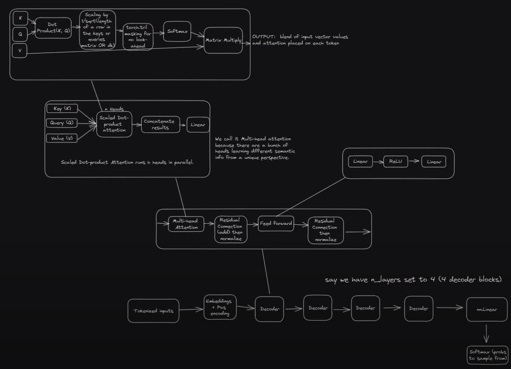

# Project files
chat_bot.py - script for using chat bot

train_py - script for training chat bot

data_prep.py -script for preparing data from OpenWebText

model_builder.py - basicly classes to recreate GPT architecture and func to create model 

utils.py - useful functions

gpt-v1.ipynb - proces of my learnig learnig LLM's

# Model architecture

# To do
## Data
fine tune using datasets from hugging face
## Training
create new test and train step for training loop
train for longer

# Resources
## Create-a-Large-Language-Model-from-Scratch
Based on https://www.youtube.com/watch?v=UU1WVnMk4E8&amp;list=WL&amp;index=10&amp;ab_channel=freeCodeCamp.org

time 4:02:09

## Research Papers
Attention is All You Need - https://arxiv.org/pdf/1706.03762.pdf

A Survey of LLMs - https://arxiv.org/pdf/2303.18223.pdf

QLoRA: Efficient Finetuning of Quantized LLMs - https://arxiv.org/pdf/2305.14314.pdf

## Data resources
OpenWebText Download - https://skylion007.github.io/OpenWebTextCorpus/
